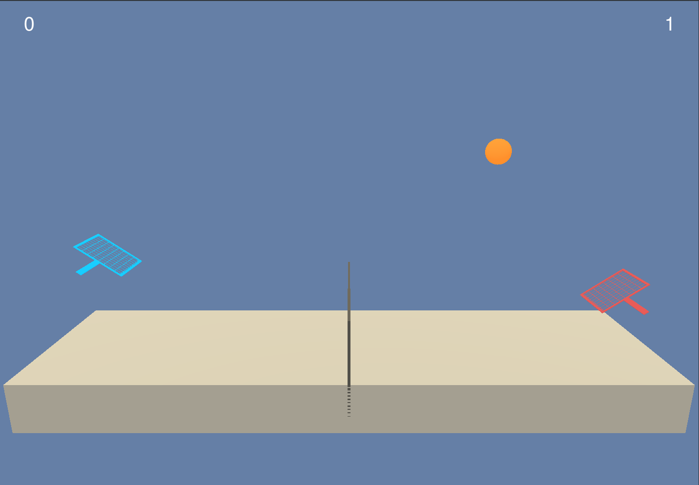

# Tennis Reinforcement Learning Agent

This repository contains a pytorch based implementation of a policy gradient
agent that can be trained to solve a tennis task [ml-agents](https://github.com/Unity-Technologies/ml-agents/blob/main/docs/Learning-Environment-Examples.md) like
environment.

</br>



</br>

</br>

## Project Details:

</br>
In this environment, two tennis playing agents attempt to maximize the amount of times they can hit the ball over the net without dropping it or hitting it the wrong way
</br>

### Agent State Space:
</br>
The reaching agent must provide a set of 2 real valued actions to the environment
</br>
0: movement left and right </br>
1: vertical movement </br>
</br>

### Agent Observaton Space:
</br>
The observation space consists of 8 variables corresponding to the position and velocity of the ball and racket. This is repeated 3 times to provide different reference frames for the agents.
</br>
</br>
### Agent Reward Structure and Solution
</br>
The agent receives a reward of +0.1 for hitting the ball over the net with the racket. -0.01 ponits are applied for letting the ball hit the surface or going out of play
</br>
</br>

## Project Dependencies:
</br>

* Ideally, GPU hardware and access to NVIDIA CUDA
    *  This can be facilitated by setting up an nvidia-docker container based on nvidia/cuda 

### Steps:
</br>

1) Setup a python virtual environment. For example:

    ```
    python -m venv env
    source env/bin/activate
    ```

2) Clone dependencies and install into docker environment:

    </br>

   * Open AI GYM

   </br>

    ```
    git clone https://github.com/openai/gym.git
    cd gym
    pip install -e .
    ```
    </br>

   * Udacity Deep Reinforcement Learning

   </br>

    ```
    git clone https://github.com/udacity/deep-reinforcement-learning.git
    cd deep-reinforcement-learning/python
    pip install .
    ```

3) Download the standalone Unity based training environment for your use case:

    * [Linux, with visuals](https://s3-us-west-1.amazonaws.com/udacity-drlnd/P3/Tennis/Tennis_Linux.zip)
    * [Linux, headless, for training](https://s3-us-west-1.amazonaws.com/udacity-drlnd/P3/Tennis/Tennis_Linux_NoVis)

    Be sure to unzip each. There are others available on that server for Windows

    Note, the software in this repository expects these Unity environments to be unzipped to a mounted directory called data. E.g.:
    ```
    /data/Tennis_Linux
    /data/Tennis_Linux_NoVis
    ```

## Agent Training:

This section describes the steps to training the agent.

The agent can be trained from the command line or a jupyter-notebook.

* After sourcing the python environment the jupyter-notebook can be started from the command line by calling 
```
jupyter-notebook --ip <IP of host> --port <Port of host>
```
* Alternatively training can be executed from the command line by running:
```
python -m train
```

### Results
* After train is run, a file called scores.csv is written to disk with information about how the training proceeded
* The policy and state value models are saved to .pth file with their respective names. Examples are in the repo
* You can use plot.ipynb to plot the graph using the scores.csv file