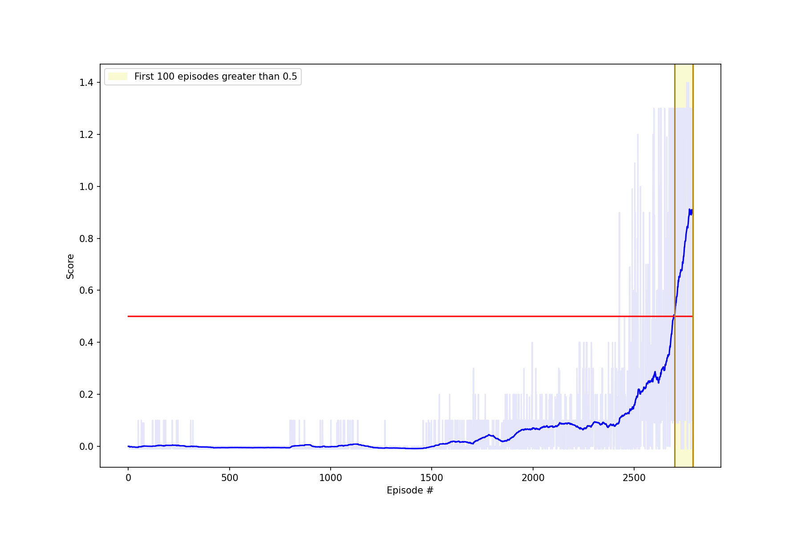

# Report

## Learning Algorithm
 

The agent algorithm implemented here was Twin Delayed Deep Deterministic policy gradient algorithm (TD3). This algorithm features neural networks as function approximators. One function approximator acts as the agent's policy; selecting the action parameters each timestep. The other function approximator is responsible for estimating the value of a state-action combination. TD3 is typically used for continuous action spaces, where the agent provides real valued (as opposed to discrete) actions to the environment. It is a policy gradient based agent that is attempting to maximize performance of its policy. The state-action function, typically refered to as the "critic" evaluates the 

### Feature: Multi Agent

In order to accomplish multi agent learning, the agents in the environment state observations were "rolled" into a single state vector. This vector was then used to train a single RL model. The action space was output in such a way that actions could be distributed to the agents playing the match.

### Feature: Exploration Noise

Another feature of the TD3 algorithm is noise that is applied to the action before the agent interacts with the environment. This noise is a non-deterministic way for the agent to explore the action space. The policy neural network is trained to always select the best action for a given state. The noise modifies this action. As training progresses, the noise is reduced. It is typical to leave some noise in the action, to help with any non-stationarity of the environment. The noise is normally distributed around mean zero with standard deviation set as a hyperparameter. Noise is clipped to ensure values remain within the environment's action space. The TD3 paper refers to this noise as exploration noise.

### Feature: Target Policy Smoothing Regularisation Noise

Noise is also introduced to the experience used for training the state-action estimator. According to the authors of TD3, this noise acts as a regularizer to ensure that similar polices are given a similar value estimate. See section 5.3 of the paper, Target Policy Smoothing Regularization.

### Feature: Experience Buffer

Training data is sampled from an experience buffer that is maintanied by the agent. Each interaction with the environment is stored in a FIFO queue. Each training timestep, experiences are uniformily sampled (number of samples equal to batch size) are provided to the network for training. This ensure that the training data for the neural networks remains independently and identically distributed (i.i.d.) despite the temporal correlations in the data at storage time.

 

For more details, see the paper where TD3 was introduced here: [https://arxiv.org/pdf/1802.09477v3.pdf](https://arxiv.org/pdf/1802.09477v3.pdf)

 
 

## Neural Network

 

Multiple neural networks are used in the policy function and the state-action value estimator function. In all cases, the network architectures used two hidden layers each with 256 nodes. Unless otherwise noted, internal activation functions were standard rectified linear units (ReLUs). Standard regularization, weight initialization, no dropout, or batch normalization was used. 

The policy function network is composed of two networks, one called "online" used for generating behavior (selecting action parameters based on the state), and another called "train" which is updated using the Adam optimization algorithm. As training progresses, the "online" network is blended with its own weights and the "train" weights. The blend is 0.5% (parameter tau) of "train's" weights and 99.5% of its own. The training is done by maximizing the value of the action for a given state based on the state-action value estimator function's approximtion of what the best action to choose is. 

The state-action value estimator function is composed of two twin neural networks. The twin networks have the same architecture and are trained in parallel. Experience trajectories are sampled from the buffer and sent through the twin networks. The network whose answer most closely matches the reward for the sampled trajectory is used for the training update. Similar to the policy estimation function, the state-action value estimator has an "online" and "train" network, which are both copies of the twins. Their weights are blended with the same method described above.

 
 

## Hyperparameters
 

The hyper parameters for the trained agent are as follows:
* Size of replay buffer: 2^20 (1048576) trajectories
* Batch Size: 256
* Gamma: 0.9
* Tau (portion of trained network to blend with online): 0.005
* Learning Rate (all networks): 0.0003
* Step interval before updating online network (policy and value estimator): 5
* Step interval before training the policy network: 2
* Step interval before training the state-action value network: 1
* Noise Decay timesteps: 200000
* Initial policy noise standard deviation: 0.5 times action space bounds (-1.0, 1.0)
* Final policy noise standard deviation: 0.1 times action space bounds (-1.0, 1.0)

Most hyper parameters were derived from those that could be found in Miguel Morales' implementation of TD3 which can be found here: [https://github.com/mimoralea/gdrl/blob/master/notebooks/chapter_12/chapter-12.ipynb](https://github.com/mimoralea/gdrl/blob/master/notebooks/chapter_12/chapter-12.ipynb)
 
 

## Other Parameters
* Timesteps per Episode: 1,000
* Default number of Episodes: 1,000,000

## Solution

The Goal for this agent is to maintain an episodic reward of greater than positive 0.5 for a window of 100 consecutive episodes. The environment is said to be solved with respect to the episode marking the start of the 100 episode window.

With the current seed and hyperparameters, the most recent policy_model.pth and state_value.pth learns to solve the task in 2700 episodes. See the above plot to see the window of episodes where the 100-episode rolling average score surpassed 30.0.

## Future Work

The model could be improved by exploring the following areas:
* Properly synchonizing training using methods such as Multi-Actor Critic could be used
* additional hyperparameters could be explored.
* additional network architectures could be explored.
* a deep dive into the environment observation space could be done to gain further understanding.
    * For instance, after recording the state space, some parameters seem to not change
* a deep dive into agent score variance with respect to different hyper parameters.
